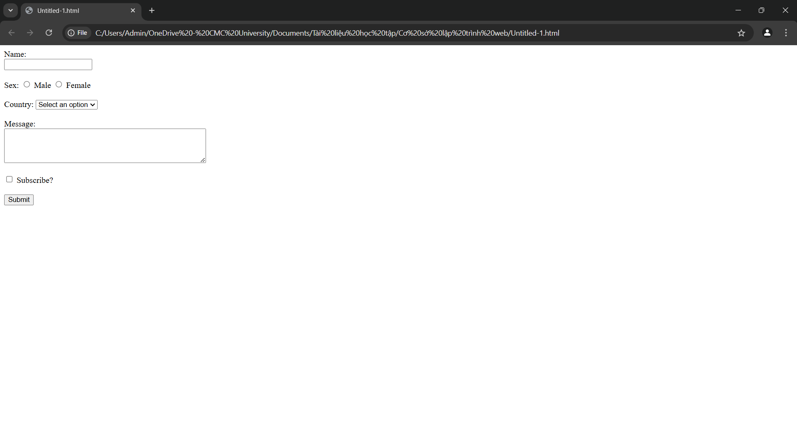
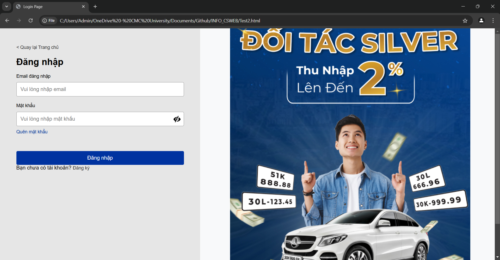
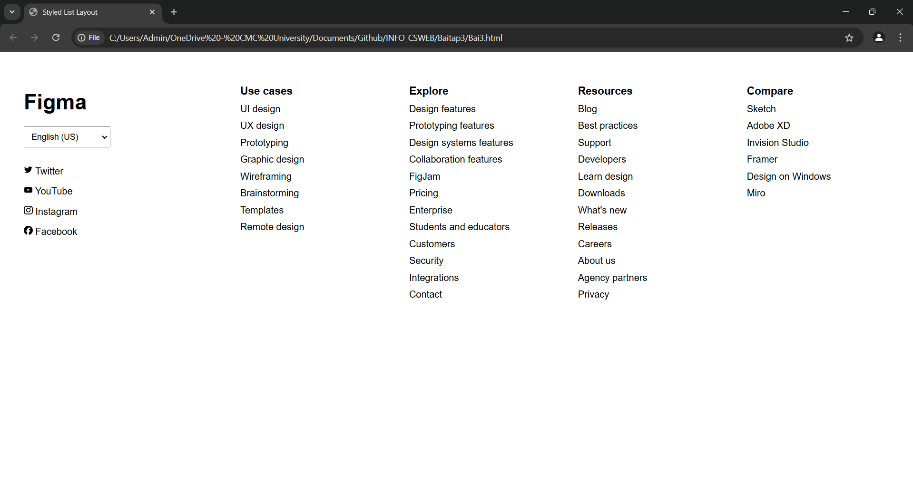
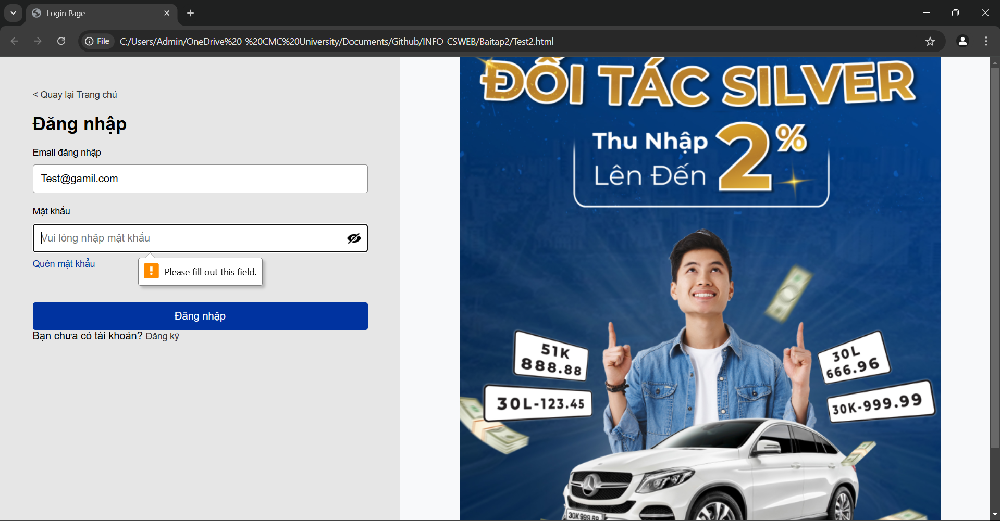
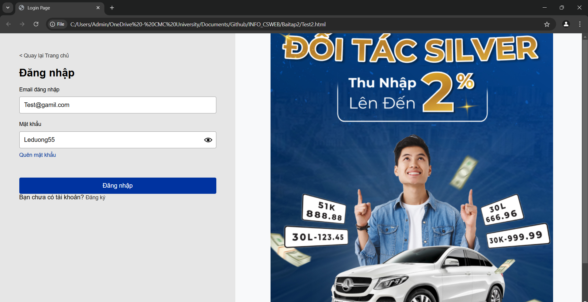

<!DOCTYPE html>
<html lang="en">
<head>
    <meta charset="UTF-8">
    <meta name="viewport" content="width=device-width, initial-scale=1.0">
    <title>Nguyễn Lê Dương - Bài Tập HTML</title>
    <link rel="stylesheet" href="styles.css">
</head>
<body>
    <header>
        <h1>Nguyễn Lê Dương - BIT230124</h1>
        <nav>
            <a href="https://www.w3schools.com/html/default.asp" target="_blank">HTML Tutorial</a>
        </nav>
    </header>
    <main>
        <section id="bai-tap-1">
            <h2>Bài Tập 1</h2>
            
        </section>
        <section id="bai-tap-2">
            <h2>Bài Tập 2</h2>
            
        </section>
        <section id="bai-tap-3">
            <h2>Bài Tập 3</h2>
            
        </section>   
        <section id="bai-tap-4">
            <h2>Bài Tập 4</h2>
            
            
            
        </section>
    </main>
    <footer>
        
© 2024 Nguyễn Lê Dương. All rights reserved.

    </footer>
</body>
</html>
